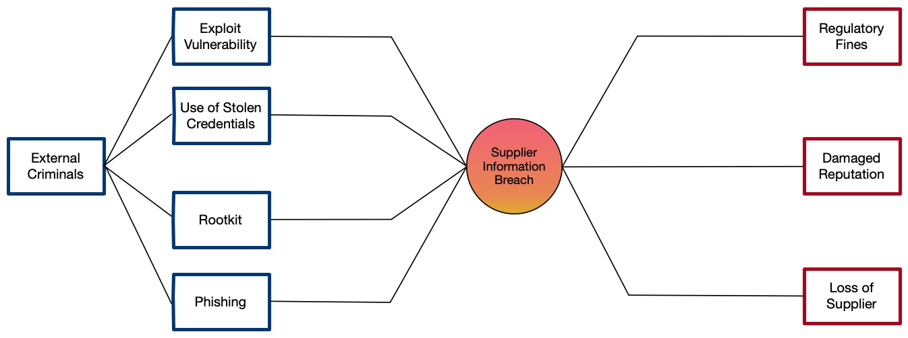
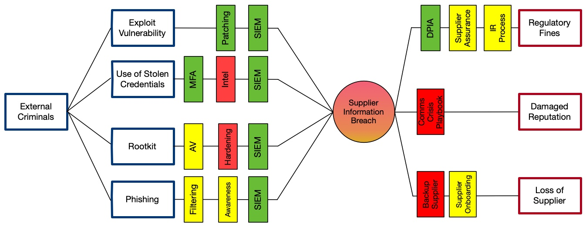

# How to use

## Risks

It’s key to understand that a risk event alone is not a risk, at it's simplest a risk can be a single risk event and the single consequence of that event.

However, it is likely as we develop our risk scenario that they will consist of the combination or one or more sources, one or more risk events and one or more consequences.

Risk events may lead to other risk events within the scenario. For example a *software exploit* may lead to *unauthorised access to a system* that then causes consequences.

## Risk Scenarios

Risk scenarios are the business-context descriptive narrative form of the risks facing your business. The risk scenarios are useful in communicating with stakeholders about the risk as they feel like real-world stories they recognise from their own experience. Risk scenarios tend to be specific to business functions and their environment.

For example:

**Title:** *"Accidental Market Sensitive Information Leak.*"  
**Description:** *"During the reporting period a member of the accounting team, under time pressure, accidentally sends a draft of the annual report to an employee at our technology outsourcer who has the same name as our Chief Financial Officer as a result of address auto-complete in their email software. If the draft leaks it could lead to market sensitive information being published ahead of the publication of the report which could lead to a regulatory sanction and trigger insider trading*".

When writing relevant risk scenarios the analyst should consider:

* **Context** - *'Who'* - Groups, Individuals, Organisations
* **Triggers** - *'Why'*, - Motivations, Goals
* **Event** - *'What, How'* - Activities, Objectives, Targets
* **Timelines** - *'When, How long'* - Triggering Events, Opportunity
* **Location** - *'Where'* - Geography, Networks
* **Responses** - *'So what'* - Harms, Likely following events

While the description of the risk scenario under consideration can be tailored to use language appropriate to the organisation in scope and the stakeholders or experts that must consider it the underlying statement of the risk that scenario represents can, and should, be standardised using the Open Information Security Risk Universe.

## Risk Statements

At it's simplest a risk scenario can be translated into a risk statement using the following structure:

There is a risk that \<**source**> causes \<**event**> occurs leading to \<**outcome**> that causes \<**consequence**>.

An example of a minimal risk statement structured as above is:

“_There is a risk that an employee accidentally emails data to an external recipient leading to an accidental market sensitive information leak which causes regulatory fines._”

“_There is a risk that an **employee accidentally** (\<source>)  **emails data to an external recipient** (\<event>) leading to an **accidental market sensitive information leak** (\<outcome>) which causes **regulatory fines** (\<consequence>)._”

By ensuring that every risk scenario is also formally stated as a risk statement it allows comparison between scenarios as well as identifying what coverage of the OSIRU is currently being considered by the organisation and whether that is appropriate.

## Bow-Tie Diagrams

Bow-Tie diagrams can be a very useful way to visualise the components of a risk. A bow-tie diagram uses the risk as the 'knot' of the tie with two trees either side, the left hand tree is a fault tree showing the causal relationships that cause the risk and the right hand tree is an event tree showing the consequences of the risk.

A simple risk such as the example given above can be represented as follows:

\<source> -> \<event> -> \<outcome> -> \<consequence>

This is much simpler than most bow-tie diagrams, a more complicated example includes the following that shows many events and consequences:

The real value of a bow-tie diagram is in evaluating the available controls and mitigations. In this context a control is a limiting factor that influences the fault tree on the left hand side whereas a mitigation is a limiting factor that influences the event tree on the right hand side.

The diagram below shows some example controls but the OSIRU is independent of control frameworks and as such to draw a bow-tie diagram such as this you would need to use both the OSIRU and your choice of control framework.

A bow-tie can be extended with concepts of frequency/likelihood, control/mitigation effectiveness and quantified consequences but these are beyond the scope of the OSIRU.

## Risk Coverage

A key use of the OISRU is to check the coverage of existing identified risks to identify any gaps. It does not take long to translate an existing risk register into the OISRU taxonomy of\
 \<source> -> \<event> -> \<consequence> \
 This then allows the contents of a risk register to be easily compared to the OISRU to see gaps.

 Below is an example of translating the top ten security risks for a firm into the universe. Red components were referenced in an existing risk, grey components were not referenced in an existing risk.

This allowed the CISO to confirm if they were comfortable with their choice of top ten risks. In this example the CISO walked through the gaps and identified the lack of hacktivists as a source of risk and the lack of malware, especially ransomware, as a risk event both worthy of generating new risk scenarios, new risk statements and performing the analysis of their expected outcomes.

This sort of comparison is also useful for IT Auditors when they provide oversight of security risk processes and security risk registers as it provides a basis for challenge and communication with the security management team.
